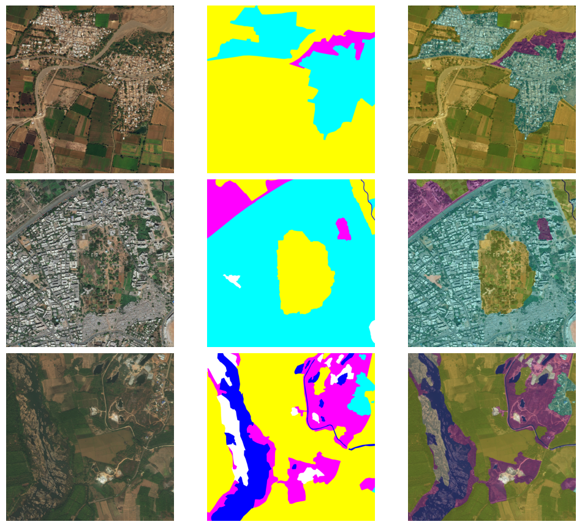

# Satellite Image Land Cover Segmentation
Cameron Braatz - 12.05.2024 
CSPB 4622 - Machine Learning

## Overview
The following notebook prepares and trains a machine learning model to perform multi-class segmentation to predict land cover types from a set of satellite images. This dataset focuses on the detection of urban, agricultural, rangeland, forest, water, barrn and unknown land covers.

Traditionally, this task was accomplished through time-intensive manual inspection of aerial/satellite imagery. Experts performing this analysis were trained to identify and differentiate the 'shape, size, pattern, color, tone, texture, shadows, geographic context and association' of the land covers classes exhibited in the landscape (USGS).

### Data Source
The dataset used for this project, DeepGlobe Land Cover Classification Dataset, was sourced from Kaggle. The dataset is comprised of:
- 803 training images and masks
- 171 validation images
- 172 test images
- `metadata.csv` image/mask index file
- `classes.csv` land cover class encoding

## Outline
The basic structure of the following notebook is as follows:

`LandCover_Segmentation_Classes`:
- Exploratory Data Analysis
    - Accessing the Data
    - Splitting Train/Test Sets
    - Visual Inspection
- Image Preprocessing
    - Testing the Image class
    - Applying Augmentations
- Mask Preprocessing
    - Testing the Mask class
    - Visualizing Class Distribution
    - Applying Augmentations

`LandCover_Segmentation_ModelPerformance`:
- Data Preparation
    - Image/Mask Processing
    - Analyzing Training Distribution
    - Model Training
- Reflection

### Navigating Repository
The undivided notebook files can be seen in the `/full` directory; go here for full-size `.ipynb`, `.pdf`, and `.html` files. From there, the splits seen in the outline above are exhibited in the `/html` and `/ipynb` directories.

Note: For proper usability, work from full notebook file when possible.